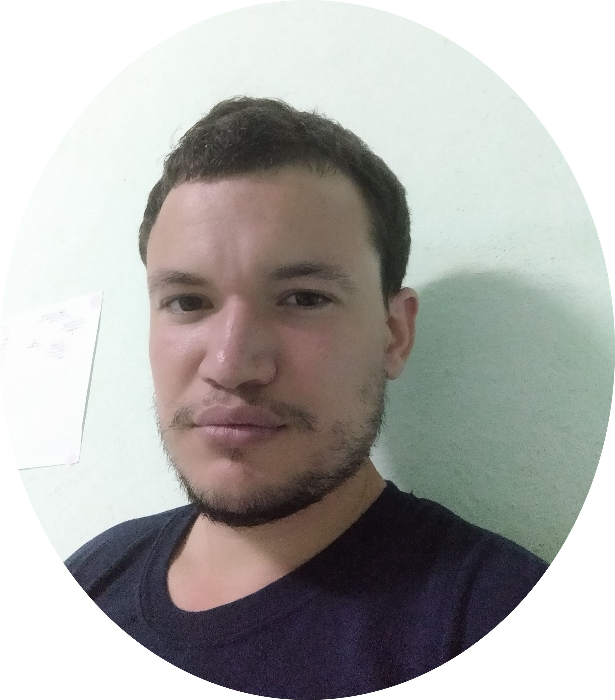

# 👋 Hola, mi nombre es Rainyel Ramos González

*Galicia, España*

**Contactos:**

[LinkedIn][4645735809913269750] / [GitHub][3501107990439883582] / [Dev.to][17961277350055325647] / [Codersrank][1097890777609527835] / [ResearchGate][12282103381254827543] / [Medium][12555484707309721380] / [YouTube][1452774931573403772] / [Twitter][8237254865795313300] / [Telegram](https://t.me/rainyel_ramos)

:envelope: rainyel.ramos@gmail.com

## Resumen
Ingeniero de Software con casi 5 años de experiencia en el desarrollo de aplicaciones backend y soluciones cloud sobre AWS. He diseñando e implementando arquitecturas escalables y mantenibles utilizando principalmente Python y Node.js (TypeScript). Me adapto con rapidez a nuevas tecnologías y lenguajes cuando 
el proyecto lo requiere. Además de mi experiencia profesional, he desarrollado proyectos personales con 
Rust, Go, Solidity, React, C#, Prolog y ensamblador x86, lo que me permite abordar los problemas desde 
una perspectiva amplia y elegir la tecnología más adecuada para cada caso. Disfruto enfrentándome a retos 
técnicos, aprendiendo continuamente y colaborando en equipos ágiles (Scrum) para construir software de 
calidad que aporte valor al negocio.

**Actualmente estoy buscando trabajo en España.**

[4645735809913269750]: https://linkedin.com/in/rainyel-ramos
[3501107990439883582]: https://github.com/rayniel95
[1452774931573403772]: https://youtube.com/channel/UCLfQBlFqyxWjXTiET5uYtKg
[12555484707309721380]: https://rainyel-ramos.medium.com/
[17961277350055325647]: https://dev.to/rayniel95
[12282103381254827543]: https://researchgate.net/profile/Rainyel_Gonzalez
[10501492827982229945]: http://www.uh.cu
[8237254865795313300]: https://twitter.com/rainyel_ramos
[11949359265179372136]: https://t.me/ranyel_ramos
[1097890777609527835]: https://profile.codersrank.io/user/rayniel95

<!-- si la persona que voy a poner no tiene informacion publica como researchgate, linkedin, etc. trato de poner algun articulo publico donde haya una foto de la misma -->
<!-- to put correctly abreviations -->
<!-- maybe write the name of some fields-->

<!-- poner al decano y a la vicedecana de la facultad en la seccion de estudios -->

<!-- explicar como en cibernetica el enfoque de las asignaturas es hacia proyectos practicos los cuales la mayoria se hacen en equipo y que muchas asignaturas tiene un lenguaje de programacion establecido para trabajar y que hay que aprender, poner ejemplos, mostrar el enfoque q tiene nuestra carrera -->

<!-- explicar que si bien no soy un experto en ninguna tecnologia soy una persona que me gusta conocer y jugar con nuevas tecnologias ademas de que me gusta escoger la tecnologia correcta para el proyecto y prefiero invertir un tiempo en investigar la mejor tecnologia y aprenderla que tirarle con lo que ya se y q probablemente me sea mas complejo -->
