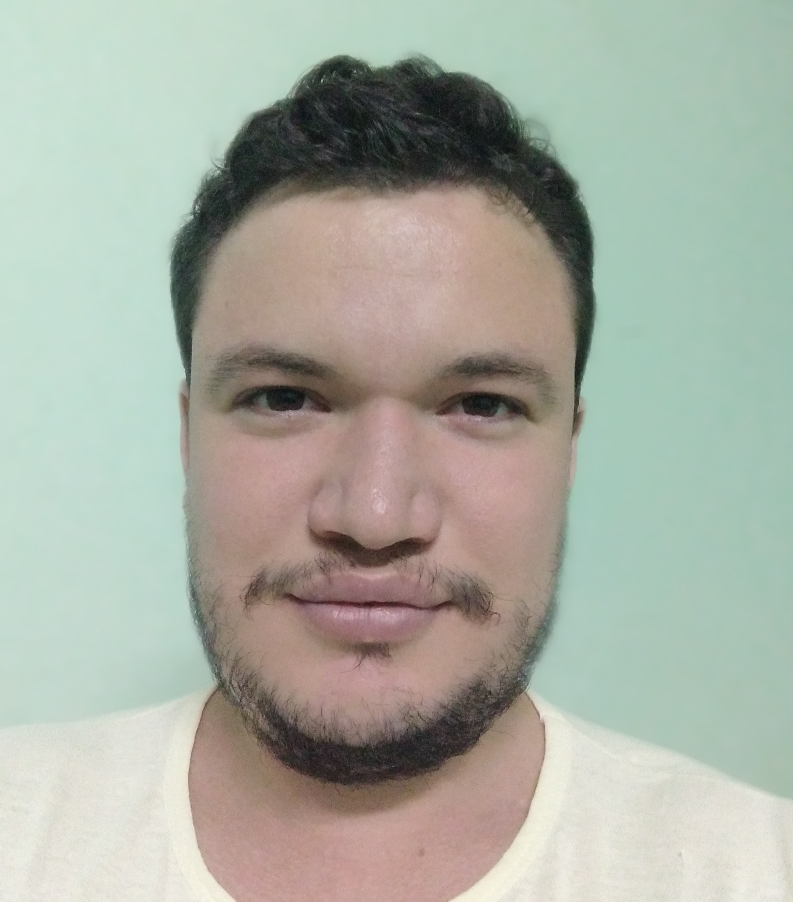

**this page is under construction**

Rainyel Ramos
Computer Scientist

Current location

**Contacts:**

[LinkedIn][1] / [GitHub][2] / [DEV][5] / [ResearchGate][6] / [Medium][4] / [YouTube][3]

Phone: 5353461326

Email: rainyel.ramos@gmail.com

# Summary
:wave: Hi there, my name is Rainyel Ramos González. I am a young computer scientist graduate in Havana University, Cuba. I graduated in November, 2020. Passionate about machine learning, blockchain technology, distributed systems and cryptography, I have read some interesting books: Distributed Systems written by Andrew S. Tanenbaum, Decentralized Applications written by Siraj Raval, Architecture for Blockchain Applications written by Xiwei Xu, Data mining: Practical machine learning tools and techniques written by Ian H. Witten, and many papers in www.researchgate.net. My interest in distributed systems started when I implemented Chord DHT in a project, I was fascinated with the auto estabilize property of this data structure. I am a hard-working, inquisitive, creative and enthusiastic computer scientist with a strong theoretical background in distributed systems, machine learning, blockchain technology, programming and math. Skilled in collaboration, adaptability and communication. Experience of 1 year in blockchain and more than 4 years of experience in software development. I like to learn new languages and technologies related with machine learning, blockchain, distributed systems and cryptography.

[1]: https://linkedin.com/in/rainyel-ramos
[2]: https://github.com/rayniel95
[3]: https://youtube.com/channel/UCLfQBlFqyxWjXTiET5uYtKg
[4]: https://medium.com/@rainyel.ramos
[5]: https://dev.to/rayniel95
[6]: https://researchgate.net/profile/Rainyel_Gonzalez

# Work experience

**Cargo**

Company name (with link to official page)

*from 1500 to 2000 d.C.*
location

very good description

- did this
- made this
- investigate about this
- propose a superapproach to solve global contamination
- implemented project CompanyName:ProjectName (see in Projects section)

Co-workers:
My Friend Name (with linkedin link and researchgate), 
My Other Friend (with linkedin link and researchgate)
... more friends (up to 15)

Usefull links with descriptions:
- Certificate name (link to photo or other)
    - description
- Notebook x (link to photo or other)
    - description
- Code X (link to photo or other)
    - description
- Letter (link to photo or other)
    - description
- Document (link to photo or other)
    - description
- Web page X (link to photo or other)
...

links to photos (certificates), presentations, code, notebooks, solved exercises,  documents to show my education

keywords: creepycomputersciencefield, rarenametechnology, ...

# Projects

Project name (with link to code or other)

*from 1500 to 2000*

very good description

- implemented this
- review this
- help to do this
- increase time with 10x
- research about this

Others creators:
My Friend Name (with linkedin link and researchgate), 
My Other Friend (this friend is not on linkedin)
... more friends

Stack: superframework (link to official page), superlanguage (link to official page), ...

keywords: creepycomputersciencefield, rarenametechnology, ...

# Skills

Knowledges: Software Development | Software Design | Software Engineering

Programming Languages: C | C# | Python | Assembly Language | TypeScript | SQL

Frameworks, libraries and tools: 

Technologies:

# Education

School Name (link to official website)

Titulacion, 

academinc discipline

*from 1500 to 2000*

score/5

Activites and groups:
Member of Superman fans club

Some usefull description.

Usefull links with descriptions:
- Certificate name (link to photo or other)
    - description
- Notebook x (link to photo or other)
    - description
- Code X (link to photo or other)
    - description
- Letter (link to photo or other)
    - description
- Document (link to photo or other)
    - description
- Web page X (link to photo or other)
...

links to photos (certificates), presentations, code, notebooks, solved exercises,  documents to show my education

Some former classmates: My Friend 1 (with linkedin link and researchgate), My Friend 2 (with linkedin link and researchgate), My Friend 3 (with linkedin link and researchgate), My Friend 4 (with linkedin link and researchgate), ... up to 15.... best linkedin profiles

Some proffessors: My Proffessor 1 (with linkedin link and researchgate), My Proffessor 2 (with linkedin link and researchgate), My Proffessor 3 (with linkedin link and researchgate), My Proffessor 4 (with linkedin link and researchgate), My Proffessor 5 (with linkedin link and researchgate), ... up to 15.... best linkedin profiles

---

School Name (link to official website)

Titulacion, 

academinc discipline

*from 1500 to 2000*

score/5

Activites and groups:
Member of Superman fans club

Some usefull description.

Usefull links with descriptions:
- Certificate name (link to photo or other)
    - description
- Notebook x (link to photo or other)
    - description
- Code X (link to photo or other)
    - description
- Letter (link to photo or other)
    - description
- Document (link to photo or other)
    - description
- Web page X (link to photo or other)
...

links to photos (certificates), presentations, code, notebooks, solved exercises,  documents to show my education

Some former classmates: My Friend 1 (with linkedin link and researchgate), My Friend 2 (with linkedin link and researchgate), My Friend 3 (with linkedin link and researchgate), My Friend 4 (with linkedin link and researchgate), ... up to 15.... best linkedin profiles

Some proffessors: My Proffessor 1 (with linkedin link and researchgate), My Proffessor 2 (with linkedin link and researchgate), My Proffessor 3 (linkedin profile link), My Proffessor 4 (with linkedin link and researchgate), My Proffessor 5 (with linkedin link and researchgate), ... up to 15.... best linkedin profiles

# Licences and certifications

Certificate Name (with link to credential photo or other)

Organization (with link to official page)

*from 1500 to 2000*

ID 2345657763434311

Certificate Name (with link to credential photo or other)

Organization (with link to official page)

*from 1500 to 2000*

ID 2345657763434311

...

# Volunteer experience

**Cargo**

Oranization (with link to official page)

*from 1500 to 2000 d.C.*

benefic cause 

very good description

- did this
- made this
- investigate about this
- propose a superapproach to solve global contamination
- implemented a artificial intelligence that cook and wash the dishes

Co-workers:
My Friend Name (with linkedin link and researchgate),
My Other Friend (with linkedin link and researchgate)
... more friends

Usefull links with descriptions:
- Certificate name (link to photo or other)
    - description
- Notebook x (link to photo or other)
    - description
- Code X (link to photo or other)
    - description
- Letter (link to photo or other)
    - description
- Document (link to photo or other)
    - description
- Web page X (link to photo or other)
...

links to photos (certificates), presentations, code, notebooks, solved exercises,  documents to show my education

Stack: superframework (link to official page), superlanguage (link to official page), ...

---

**Cargo**

Oranization (with link to official page)

*from 1500 to 2000 d.C.*

benefic cause 

very good description

- did this
- made this
- investigate about this
- propose a superapproach to solve global contamination
- implemented a artificial intelligence that cook and wash the dishes

Co-workers:
My Friend Name (with linkedin link and researchgate),
My Other Friend (with linkedin link and researchgate)
... more friends

Usefull links with descriptions:
- Certificate name (link to photo or other)
    - description
- Notebook x (link to photo or other)
    - description
- Code X (link to photo or other)
    - description
- Letter (link to photo or other)
    - description
- Document (link to photo or other)
    - description
- Web page X (link to photo or other)
...

links to photos (certificates), presentations, code, notebooks, solved exercises,  documents to show my education

Stack: superframework (link to official page), superlanguage (link to official page), ...

...

# Courses

Course 1

Course 2

...

# Test scores

Test x

*date*

*score/5*

Test x

*date*

*score/5*

...

# Languages

Spanish

English

# Publications
Publication name (with link to publication)

*date* *editorial (with link to editorial)* 

very good description text

- did this
- made this
- investigate about this
- propose a superapproach to solve global contamination
- implemented a artificial intelligence that cook and wash the dishes

Others autors:
My Friend Name (with linkedin link and researchgate)
My Other Friend (with linkedin link and researchgate)
... more friends

Stack: superframework (link to official page), superlanguage (link to official page), ...

keywords: creepycomputersciencefield, rarenametechnology, ...

---

Publication name (with link to publication)

*date* *editorial (with link to editorial)* 

very good description text

- did this
- made this
- investigate about this
- propose a superapproach to solve global contamination
- implemented a artificial intelligence that cook and wash the dishes

Others autors:
My Friend Name (with linkedin link and researchgate),
My Other Friend (with linkedin link and researchgate)
... more friends

Stack: superframework (link to official page), superlanguage (link to official page), ...

keywords: creepycomputersciencefield, rarenametechnology, ...

...